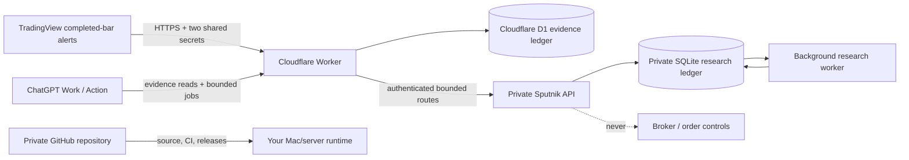

# Sputnik AI Analytics

Local-first market/news telemetry, private portfolio evidence, reproducible
Python research, and a narrow API that ChatGPT Work can call through an Action.

The repository receives **completed TradingView bars** and alert events,
stores them in an immutable SQLite evidence ledger, exposes authenticated price
context, and runs backtests or Friday-close to next-session-open studies in a
durable background worker.

> **NO BROKER · NO ORDERS · RESEARCH AND DECISION SUPPORT ONLY**

## The important architecture boundary

GitHub stores source code, tests, and release history. GitHub is **not** the
live-price backend. The deployed Cloudflare Worker receives TradingView and
approved news webhooks into D1. ChatGPT reaches authenticated evidence reads at
the Worker, which can proxy bounded Python compute to a private origin. Codex is
not part of the production compute path.



## What is implemented

- Authenticated TradingView `bar`, `price`, and `alert` ingestion.
- Completed-bar enforcement and OHLCV integrity checks.
- Secret stripping before storage, request-size limits, idempotent replay, and
  rejection of conflicting historical bars.
- SQLite WAL persistence with raw event hashes, normalized bars, price points,
  and durable research jobs.
- Price, news, private portfolio summary, webhook coverage, and full setup-event context for ChatGPT.
- Versioned ChatGPT Work configuration and correction records that preserve the raw ledger.
- A scheduled liquid-ASX panel that ranks fresh completed-bar setups during the Sydney session.
- Bounded forecast, backtest, weekend-gap, and portfolio-review job creation.
- Separate reader, bounded-operator, and admin authentication.
- Friday-close to next-session-open gap studies across as many supplied symbols
  as the database contains, including optional cross-market regime rules.
- Existing OOO macro-confluence strategy, next-open simulator, costs, slippage,
  ATR stops/targets, deterministic reports, and bounded parameter sweeps.
- Privacy-safe Westpac EOFY import with brokerage reconciliation; account IDs
  and contract-note numbers are never persisted.
- Dataset fingerprints, engine versions, sample-size gates, Wilson intervals,
  provenance labels, and explicit research limitations.
- Docker Compose API + worker deployment and an optional Cloudflare Tunnel.
- Deployed Cloudflare Worker and D1 evidence edge with a retrying private-origin sync outbox.
- Pine Script completed-bar streamer and a restricted ChatGPT OpenAPI schema.
- CI, free source/dependency security checks, Dependabot, container publishing,
  tests, and security guidance.

## Repository map

```text
.github/                      CI, CodeQL, dependency updates, releases
configs/                      Strategy, alert-universe, and scheduler assumptions
docs/openapi-chatgpt.yaml     ChatGPT evidence and bounded-compute contract
tradingview/                  Pine completed-bar stream and payload examples
src/sputnik/api.py            Authenticated HTTP API
src/sputnik/storage.py        SQLite evidence ledger and job queue
src/sputnik/jobs.py           Durable analytics worker
src/sputnik/gap_study.py      Weekend-gap and regime-frequency engine
src/sputnik/backtest.py       Next-open portfolio simulator
src/sputnik/portfolio.py      Private broker import, FIFO, and trade review
src/sputnik/strategy.py       Explainable OOO macro score
tests/                        Unit and API integration tests
```

## Quick start

Requires Python 3.11+.

```bash
python3 -m venv .venv
source .venv/bin/activate
python -m pip install '.[dev]'
cp .env.example .env
```

Generate seven independent secrets and place them in `.env`:

```bash
python -c 'import secrets; print(secrets.token_urlsafe(32))'
```

Load `.env` into your shell, then start the API and worker in separate terminals:

```bash
set -a; source .env; set +a
sputnik serve --port 8765
```

```bash
set -a; source .env; set +a
sputnik worker --poll-seconds 5
```

Or run the private runtime with Docker:

```bash
docker compose up --build -d api worker
curl http://127.0.0.1:8765/health
```

The server binds to localhost by default. TradingView needs a public HTTPS
route; follow [the deployment guide](docs/deployment.md) instead of exposing the
database or an unauthenticated port.

## Private portfolio import

Broker files are imported locally by CLI and never sent through a public
endpoint. The adapter detects the Westpac report preamble, keeps only validated
Buy/Sell rows, hashes source identity, drops account/HIN/contract-note fields,
and optionally reconciles transaction brokerage to the EOFY PDF.

```bash
sputnik import-portfolio \
  --transactions /absolute/path/to/EOFYTransactions.csv \
  --summary /absolute/path/to/EOFYSummary.pdf
```

The resulting private SQLite ledger supports aggregate FIFO behavior review and
point-in-time comparison with stored `ASX:<code>` bars. It is provisional
research—not tax-lot, corporate-action, or broker reconciliation.

## TradingView ingestion

Use the dedicated Pine script in
[`tradingview/sputnik_bar_stream.pine`](tradingview/sputnik_bar_stream.pine).
It emits once per completed bar. Configure the alert webhook URL as:

```text
https://sputnik-market-edge.youri-oratch.workers.dev/v1/webhooks/tradingview/YOUR_WEBHOOK_ID
```

Example body:

```json
{
  "schema_version": 1,
  "kind": "bar",
  "secret": "YOUR_PAYLOAD_SECRET",
  "symbol": "ASX:OOO",
  "timeframe": "1D",
  "timestamp": "2026-07-23T06:00:00Z",
  "open": 8.42,
  "high": 8.55,
  "low": 8.38,
  "close": 8.48,
  "volume": 206000,
  "confirmed": true
}
```

The webhook ID and payload secret are different values. TradingView does not
send arbitrary authorization headers, so this two-part HTTPS contract avoids
pretending header authentication is available.

## News webhook evidence

An approved collector can post source, headline, HTTPS URL, publication time,
related symbols, a short summary, and category to:

```text
POST /v1/webhooks/news/YOUR_NEWS_WEBHOOK_ID
```

The news secret is removed before storage. Configure
`SPUTNIK_NEWS_ALLOWED_DOMAINS` to restrict accepted source hostnames. The API
does not scrape arbitrary URLs, store full articles, or infer market direction
from a headline.

## ChatGPT Work access

Import [`docs/openapi-chatgpt.yaml`](docs/openapi-chatgpt.yaml) as a ChatGPT
Action and configure **Bearer** authentication with `SPUTNIK_OPERATOR_KEY`. It
can retrieve evidence, save versioned bounded settings, record sourced corrections,
and enqueue Python jobs. It cannot ingest raw webhook data, write GitHub, or
access broker and order surfaces. Use `SPUTNIK_API_KEY` for strictly read-only clients.

Examples:

```bash
curl -H "Authorization: Bearer $SPUTNIK_API_KEY" \
  'http://127.0.0.1:8765/v1/prices/latest?symbols=ASX:OOO,TVC:DXY&timeframe=1D'

curl -H "Authorization: Bearer $SPUTNIK_API_KEY" \
  'http://127.0.0.1:8765/v1/context/ASX:OOO'
```

See [ChatGPT Action setup](docs/chatgpt-action.md).

## Background weekend-gap study

This request computes historical frequencies; it does not manufacture a live
forecast. The worker will fail or mark results `insufficient_sample` when the
database does not contain enough completed daily bars.

```bash
curl -X POST http://127.0.0.1:8765/v1/research/weekend-gaps \
  -H "Authorization: Bearer $SPUTNIK_ADMIN_KEY" \
  -H 'Content-Type: application/json' \
  -d '{
    "symbols": ["ASX:OOO", "ASX:WDS", "ASX:EVN"],
    "timeframe": "1D",
    "factor_symbols": {
      "oil": "TVC:USOIL",
      "dxy": "TVC:DXY",
      "gold": "TVC:GOLD"
    },
    "rules": [
      {"field": "oil_return", "operator": "ge", "value": 0.03},
      {"field": "dxy_return", "operator": "gt", "value": 0.0},
      {"field": "gold_return", "operator": "lt", "value": 0.0}
    ],
    "cost_bps": 10,
    "minimum_samples": 20
  }'
```

Poll the returned job ID with the read-only key:

```bash
curl -H "Authorization: Bearer $SPUTNIK_API_KEY" \
  http://127.0.0.1:8765/v1/research/jobs/JOB_ID
```

Results report baseline and conditioned sample counts, historical positive-gap
frequency, a 95% Wilson interval, odds, average/median gap, tails, costs, date
range, dataset SHA-256, and limitations. They never become an order instruction.

## Existing strategy backtest

The archive's original OOO model remains available:

```bash
sputnik backtest \
  --prices data/private/ooo_daily.csv \
  --macro data/private/macro_daily.csv \
  --config configs/ooo_daily.yml \
  --output reports/ooo
```

Signals execute at the next bar's open; current-bar breakouts are excluded;
point-in-time macro joins look backward; costs and slippage are included; and a
stop is assumed to trigger before a target when daily-bar ordering is unknown.

For software verification only:

```bash
sputnik demo --days 900 --output reports/demo
```

Synthetic results have no market meaning.

## Research integrity

- A TradingView webhook observation is labelled as such; it is not silently
  promoted into independently verified exchange truth.
- Ad-hoc price alerts do not make a complete OHLCV history. Backtests require a
  completed-bar stream and a completeness audit.
- Conditional historical frequency is not a calibrated probability forecast.
- Parameter changes after seeing results create a new hypothesis.
- Full ASX scans require a documented universe, delistings/corporate actions,
  sufficient liquidity, complete licensed history, and survivorship controls.
- Backtests and rankings are research artifacts, never execution authority.

Read [research integrity](docs/research-integrity.md) before interpreting a run.

## Test and lint

```bash
make lint
make test
```

## GitHub publication

Keep the repository private until the live endpoint, strategy assumptions, and
data licensing are reviewed. Never commit `.env`, SQLite/WAL files, raw webhook
logs, private CSVs, reports containing sensitive data, or tunnel credentials.

See [SECURITY.md](SECURITY.md) for rotation and incident steps.
