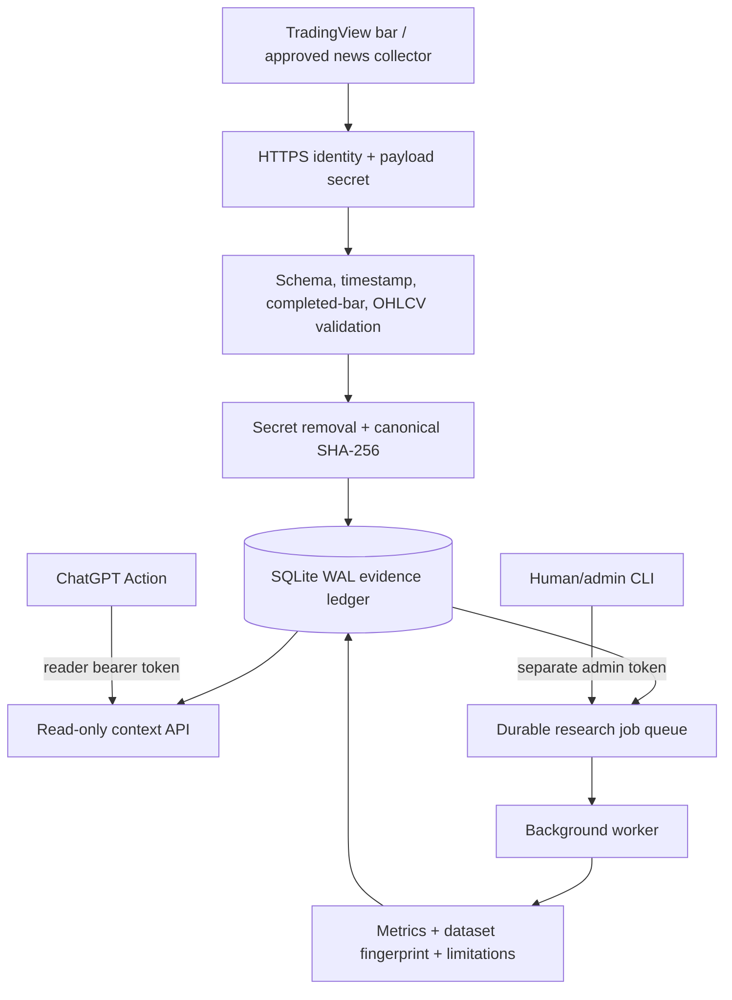

# Architecture

## Trust and data flow

## Security domains

| Domain | Credential | Capabilities |
|---|---|---|
| TradingView ingestion | Path webhook ID + body secret | Append validated evidence only |
| ChatGPT Work | API bearer key | Evidence reads and bounded Python job enqueue |
| Research admin | Admin bearer key | Enqueue bounded jobs |
| Worker | Local database volume | Claim and complete jobs |

No domain contains broker, account, credential-inspection, or order controls.

## Storage invariants

- The shared secret is removed before canonicalization and persistence.
- A canonical payload hash is the event identity, making retries idempotent.
- `(symbol, timeframe, event_time)` is the completed-bar primary key.
- A different payload attempting to overwrite that key is rejected with 409.
- Market time and receive time are stored separately.
- SQLite runs in WAL mode and every process opens independent connections.
- Research jobs move monotonically from `pending` to `running` to a terminal
  `completed` or `failed` state.
- Private broker imports occur only through the local CLI; account/HIN and
  contract-note identifiers are not stored or exposed to ChatGPT.

## Research layers

| Layer | Responsibility | Does not do |
|---|---|---|
| Evidence | Validate, timestamp, hash, store, query | Invent missing observations |
| Feature/regime | Point-in-time transforms and explicit rules | Label prose as data |
| Strategy | Explainable completed-bar signals | Execute orders |
| Simulator | Next-open fills, costs, stops, equity | Claim out-of-sample proof |
| Gap study | Historical frequencies, tails, intervals | Convert frequencies to live forecasts |
| Reasoning API | Present source, freshness, limitations | Expose admin or broker actions |

## Scaling path

SQLite is appropriate for one private runtime and moderate webhook volume. A
larger multi-user deployment should replace the storage adapter with Postgres,
run a real queue, add per-route rate limiting at the edge, and retain the same
immutable evidence and separate-credential contracts.
